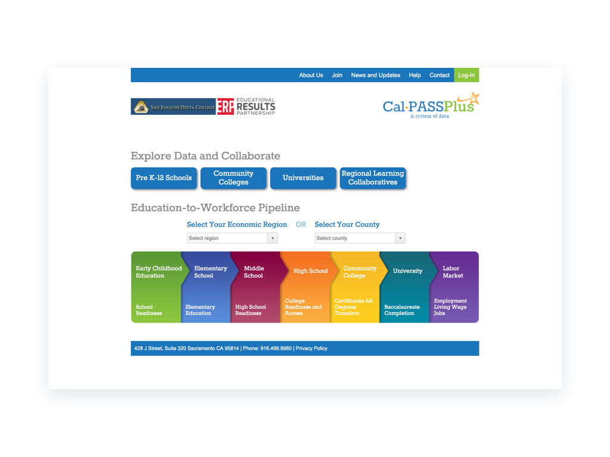
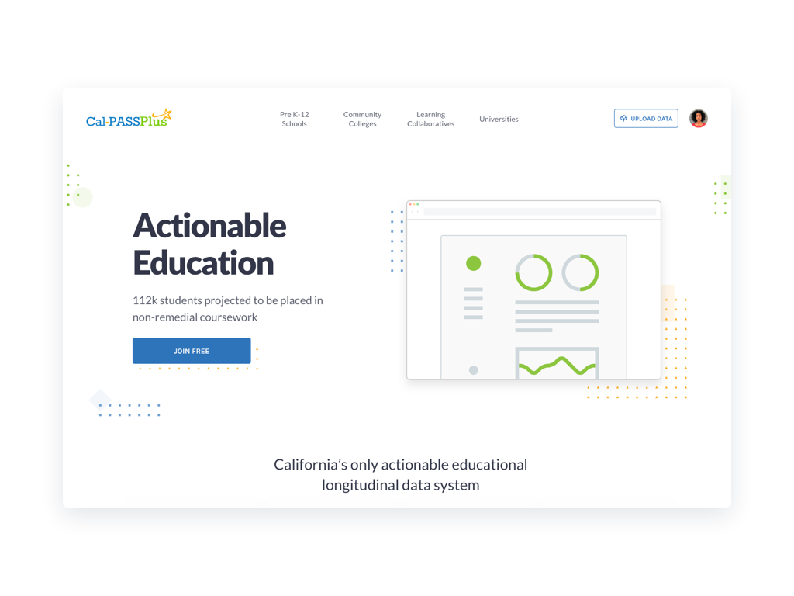
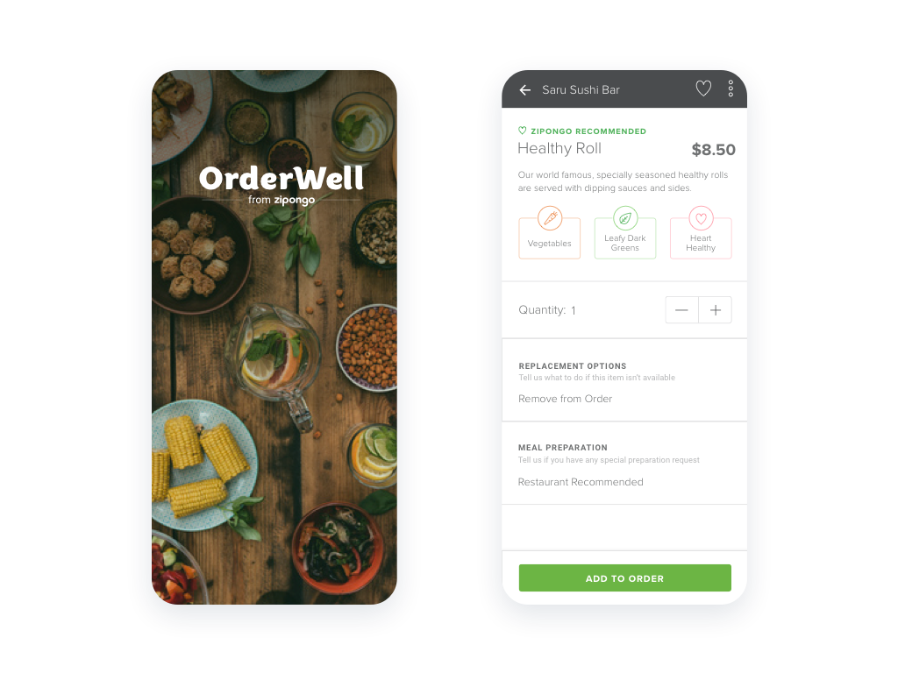
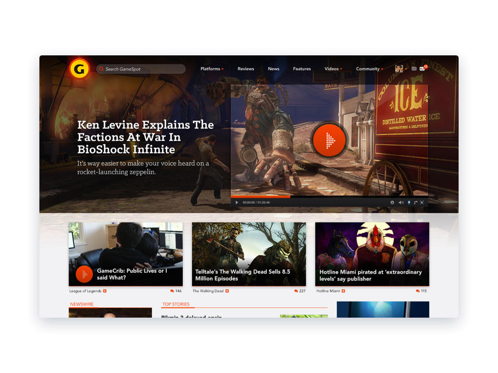
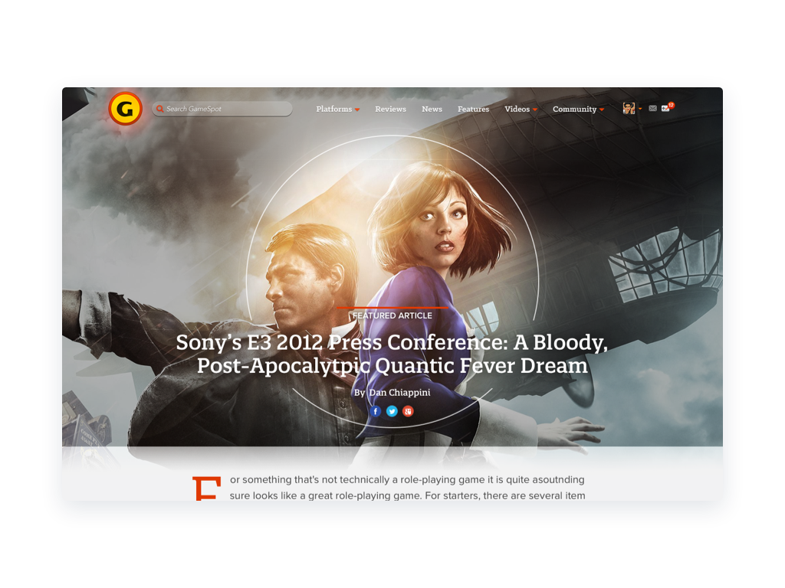
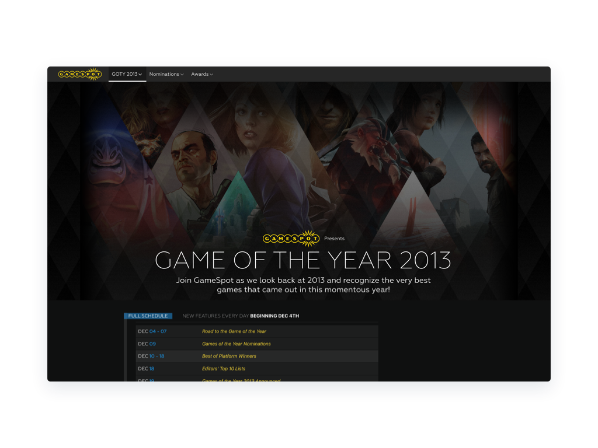
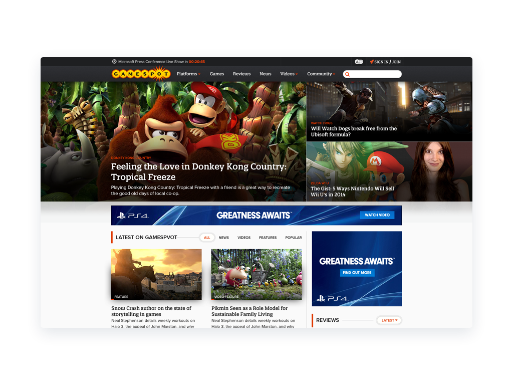
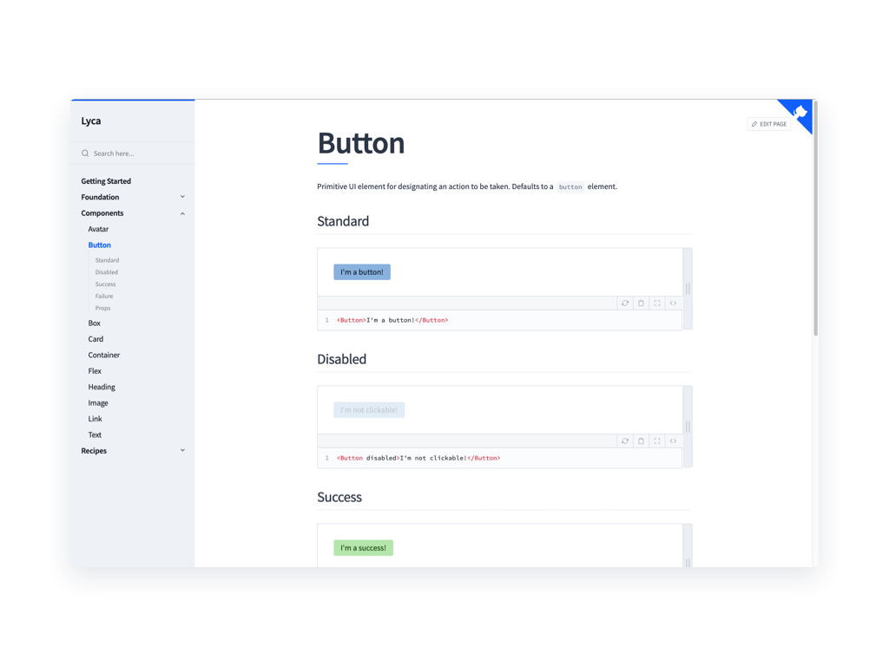

import { Split } from 'mdx-deck/layouts';
import { Image, Appear } from 'mdx-deck';
import { Box, Button, Flex } from '@puppies4life/lyca';

export { swiss as theme } from 'mdx-deck/themes';

# 👋 Hello!

---

[https://admiring-wing-b7a0b9.netlify.com](https://admiring-wing-b7a0b9.netlify.com)

---

## Jesse Brack

Freelance Designer & Developer

[jessebrack.com](www.jessebrack.com)

```notes
- design: product & visual
- developer: UI development
```

---

```CSS
.css {
	position: var(--my-❤);
}
```

```notes
- Geocities
```

---

> "Less but better"

\- Dieter Rams

```notes
- Easy to add
- Work and life
- Trust others
```

---

<a href="https://codepen.io/Puppies4Life/pen/BbBjOg" target="_blank"></a>

```notes
- Learning
- Life fun
- Profession always evolves
```

---

# Design

```notes
- Start with design > development
- Lots of these will be smaller pieces
- Main piece at end (Lyca)
- Encourage discussion
```

---

<a href="videos/yosemite.mp4" target="_blank"></a>

```notes
**Goals**
- Sketch
- Invision Studio
- Transitions
- Parallax
```

---

<a href="videos/magazine.mp4" target="_blank"></a>

```notes
**Goals**
- Sketch
- Push Invision's animation capabilities
```

---



```notes
** Intro **
- Non-profit improve student outcomes though crowd sourcing data
** Goals **
- Improve the presentation and usefulness of their homepage
** Empathy **
- High school principles, community college administrators
- Short turnaround time, low resources and budget
** Problems **
- Visual design
- Tool finding
- Storytelling
- Limited resources and budget
```

---

<a href="images/calpass-source.png" target="_blank"></a>

```notes
** Results **
- Updated visual design based on logo
- Improved IA of navigation and tools
```

---



```notes
** Intro **
- Zipongo
- Healthy meal ordering app
** Goals **
- Orig - design meal first UX
** Empathy **
- Working parents
** Problems **
- Product direction based on assumptions
- Incredibly short turnaround time
** Direction **
- Rapid prototype
- User testing
** Outcome **
- Invalidated hypothesis
- Gained insight into new predictive personas
- Pivoted
```

---

# Development

---

<a href="images/gs1-source.jpg" target="_blank"></a>

```notes
** Intro **
- Leading gaming media and news site
- Joined 2013 during redesign
** Problems **
- Jumping into redesign, execute immediately
- Balance fun, unique designs with manageable code base
```

---

```CSS
/* media.scss */

.media { ... }
.media-figure { ... }
.media-body { ... }
.media-title { ... }
```

```notes
- Context: Modular CSS, SASS, Compass, Variation BEM methodology
```

---

```HTML
<article class="media">
	<figure class="media-figure">...</div>
	<div class="media-body">
		<div class="media-title">...</div>
		...
	</div>
</article>
```

---

<a href="images/gs2-source.png" target="_blank"></a>

---



---

<a href="images/gs4-source.png" target="_blank"></a>

---

# 🐕 Lyca

---

<a href="https://elated-cori-1eb692.netlify.com/" target="_blank"></a>

```notes
- ** Intro **
- Explain what Lyca is
- ** Problems **
- Clients were React based
- CSS was a mess
- Design needs required something custom
- Friendly to developers who didn't use CSS
- Move fast
- Need constraints to future-proof
- Small and simple for high resusability because of its shared nature
- **Walkthrough**
- **Explain what I like and don't like**
- Design tokens become a first-class citizen
- Consistent props
- Not writing classnames
- Not writing CSS that is dependent on HTML
- Encapsulation of styling, no context switching or class hunting
- Composing is far easier, not writing new CSS
```

---

# Thank you! 🙂

---
