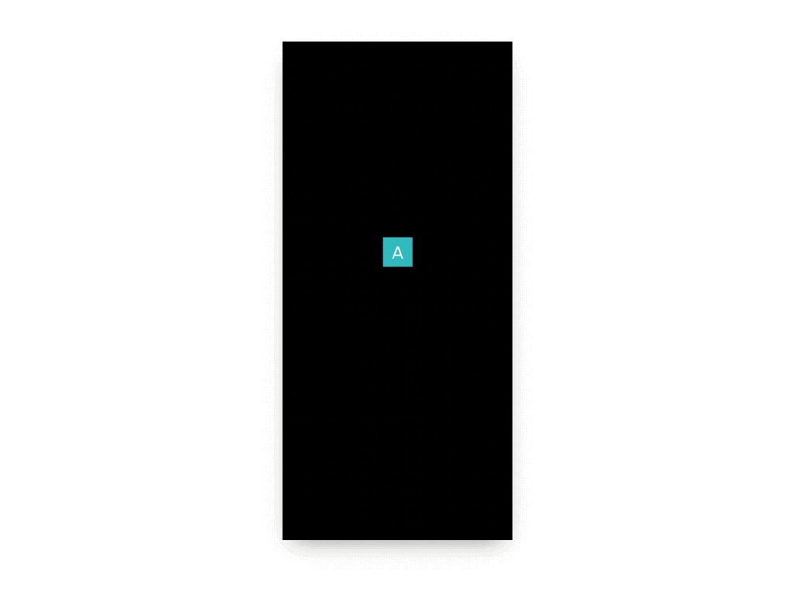

import { Split } from 'mdx-deck/layouts';
import { Image } from 'mdx-deck';
import { Box, Flex } from '@puppies4life/lyca';
import Background from './components/Background';

export { default as theme } from './theme';

# 👋 Hello!

```notes
These are only visible in presenter mode
```

---

## Freelance Designer & Developer

[jessebrack.com](www.jessebrack.com)

```notes
- Product and visual design
- UI development
```

---

```CSS
.css {
	position: var(--my-❤);
}
```

---

> "Less but better"

\- Dieter Rams

```notes
- work and life
- trust others
```

---

<a href="https://codepen.io/Puppies4Life/pen/BbBjOg" target="_blank"></a>

```notes
- curiousity makes life fun for me
- always something new to learn in this profession
```

---

<a href="videos/yosemite.mp4" target="_blank"></a>

---

<a href="videos/magazine.mp4" target="_blank"></a>

---

# Thank you! 🙂
